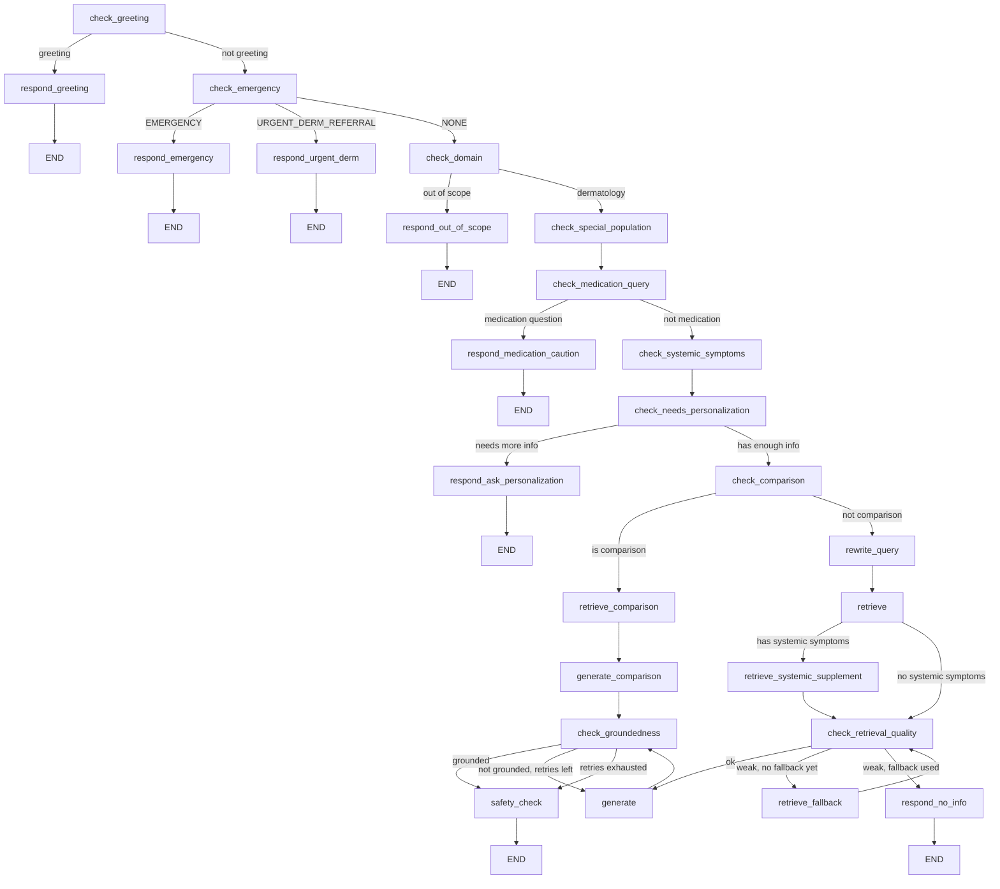

# Dermatology RAG Assistant

A dermatology question-answering chatbot built on a **LangGraph decision graph**, not a simple retrieve-then-generate pipeline. Every response passes through a series of safety, triage, and quality gates before it reaches the user — the system is designed to fail safely rather than confidently hallucinate on medical topics.

## Why this exists

Naive RAG chatbots retrieve some chunks and generate an answer. That's not good enough for a medical domain: a bot that casually confirms steroid dosing, misses an emergency symptom, or invents a home remedy ingredient can cause real harm. This project treats the *decision of whether and how to answer* as seriously as the answer itself.

## What it does

- **Emergency triage first.** Every message is classified into `EMERGENCY`, `URGENT_DERM_REFERRAL`, or `NONE` before anything else runs. A message describing active bleeding, a non-blanching rash with fever, or facial swelling short-circuits straight to an "seek care now" response — it never reaches retrieval or generation.
- **Medication safety gate.** Questions about using, continuing, or tapering a specific medication are pulled out of the normal RAG flow and handled by a dedicated node that reasons about three distinct cases (leftover/repurposed medication, currently prescribed medication, general/OTC use) and gives categorically different guidance for each — including flagging when a requested medication (e.g. a topical steroid) could worsen a described condition (e.g. a fungal infection).
- **Special-population awareness.** Pregnancy/breastfeeding and pediatric contexts are detected and change what the model is allowed to say — for example, it will not name any treatment class for an undiagnosed rash on a child, regardless of what the retrieved context suggests.
- **Self-correcting retrieval.** If an initial vector search returns weak matches, the query is automatically rewritten into cleaner clinical terminology and retried once before giving up.
- **Groundedness checking with bounded retries.** After generation, a separate LLM call verifies the answer is actually supported by the retrieved context. Ungrounded answers trigger a stricter regeneration pass, capped at a fixed retry limit so the graph can never loop indefinitely.
- **Conversational clarification.** For symptom or personalization questions that are underspecified, the bot asks targeted follow-up questions instead of guessing — but is capped at a maximum number of clarification rounds so it can't stall a conversation forever.
- **Query rewriting for multi-turn context.** Follow-up messages (e.g. a one-line answer to a clarifying question) are merged with the original request into a single standalone query before retrieval, since the vector search has no memory of conversation history on its own.
- **Comparison handling.** "X vs Y" questions are routed to a dedicated retrieval and generation path that pulls balanced context per subject and renders a structured comparison table.
- **Systemic-symptom detection.** If a skin finding is described alongside non-skin symptoms (e.g. fatigue, weight change, increased thirst), the graph supplements retrieval with content on skin findings linked to systemic/metabolic conditions, and the prompt is instructed not to dismiss the two as unrelated.

## Architecture

The whole thing is a single compiled `StateGraph`. Shared state (query, conversation history, retrieved chunks, triage tier, retry counters, etc.) flows through every node; conditional edges decide the next step based on that state.



Two loops exist in the graph, and both are protected against running forever:
- `retrieve_fallback` can only fire once per turn (`retrieval_fallback_used` flag).
- `check_groundedness` can only send generation back for a retry a fixed number of times (`retry_count` vs. `MAX_RETRIES`).

## Tech stack

| Component | Choice |
|---|---|
| Orchestration | [LangGraph](https://github.com/langchain-ai/langgraph) |
| LLM inference | Groq (`openai/gpt-oss-20b`) |
| Embeddings | `BAAI/bge-base-en-v1.5` (Sentence-Transformers) |
| Reranking | `cross-encoder/ms-marco-MiniLM-L-6-v2` |
| Vector store | ChromaDB (persistent, local) |

## Project structure

```
.
├── chroma_db_bge/       # persisted vector store (dermatology collection)
├── main.py              # graph definition, nodes, routing, and CLI entry point
└── .env                 # GROQ_API_KEY
```

## Setup

```bash
pip install langgraph groq chromadb sentence-transformers python-dotenv
```

Create a `.env` file with:

```
GROQ_API_KEY=your_key_here
```

Make sure a populated Chroma collection named `dermatology` exists at `chroma_db_bge/` before running.

## Usage

```bash
python main.py
```

The script runs a short scripted conversation by default (see `if __name__ == "__main__":`). To use it interactively, wrap `ask(query)` in a loop reading from `input()`.

```python
from main import ask

ask("what does ringworm look like?")
ask("can I use hydrocortisone on it?")
```

Conversation state (including which assistant turns were clarifying questions) is tracked in-memory across calls to `ask()` within a single process.

## Design notes worth knowing

- **Clarification round-counting is structural, not string-matched.** Rather than trying to detect "did the assistant already ask a follow-up question" by pattern-matching LLM-generated text (which varies with temperature), the graph sets an explicit `is_clarification` flag on the assistant's turn and counts that.
- **Retrieval quality is threshold-gated on the reranker's top score**, not just on whether any documents came back — an empty result and a weak result are both treated as failure, triggering the fallback rewrite.
- **Safety disclaimers are appended programmatically** (`safety_check`), not left to the LLM to remember to include, and are tailored to population (pregnancy/pediatric get specific language; general medical-keyword answers get a generic disclaimer).

## Known limitations / possible next steps

- Every classification step (greeting, domain, emergency tier, medication, personalization, comparison, systemic symptoms) is a separate LLM call — this is accurate but adds latency; some could plausibly be merged into fewer calls.
- No automated eval suite yet for routing accuracy (e.g. does `check_emergency` reliably catch the tiers it's meant to).
- Single-process, in-memory conversation history — no persistence/checkpointing across restarts yet (a natural next step given LangGraph's built-in checkpointer support).

## Disclaimer

This project is an educationalsystem for exploring safety-aware RAG architecture. It is not a medical device and is not intended to provide diagnosis or treatment advice.
